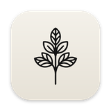
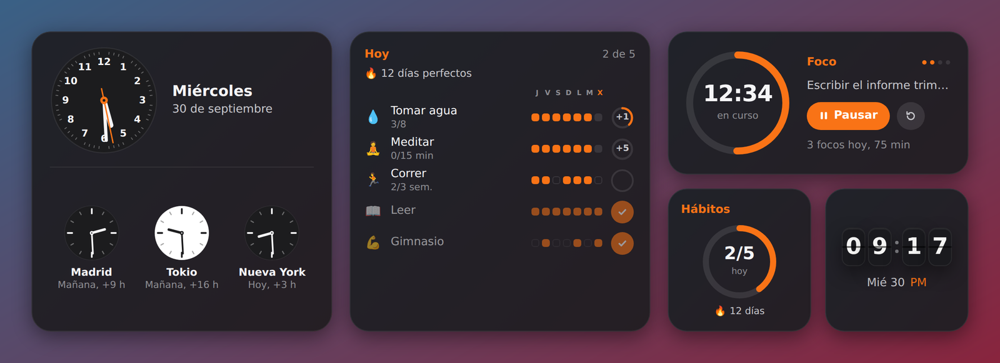
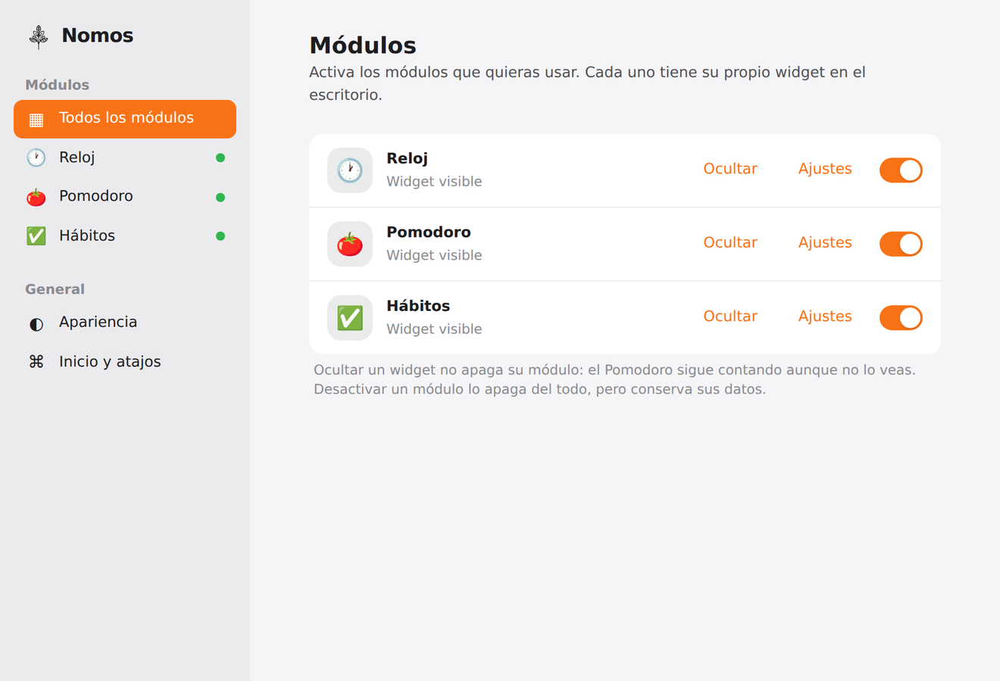

<p align="center">
  
</p>

<h1 align="center">Nomos</h1>

<p align="center">
  Widgets de escritorio estilo macOS para Windows: reloj, Pomodoro y hábitos con recordatorios.
</p>

<p align="center">
  <picture>
    <source media="(prefers-color-scheme: light)" srcset="docs/widgets-light.png" />
    
  </picture>
</p>

Nomos pone en el escritorio tarjetas pequeñas, como los widgets de macOS. Cada módulo tiene su propio widget, y todos se manejan desde un Panel de control y desde el ícono de la bandeja. Puedes activar solo los módulos que uses.

## Módulos

### 🕐 Reloj
- Estilo **flip** o **analógico** (con o sin segundero), en formato de 12 o 24 horas.
- Tamaño pequeño: la hora. Mediano: hora y fecha. Grande: hasta **3 relojes de otras ciudades** (43 ciudades disponibles), con etiquetas como «Mañana, +9 h».

### 🍅 Pomodoro
- Temporizador de foco con descansos cortos y largos, y duraciones configurables.
- Sigue contando aunque el widget esté oculto, porque el tiempo corre en el proceso principal.
- Lista de tareas y estadísticas en el Panel. Cada sesión puede ir a una tarea o a un hábito de duración, y al terminar se suman los minutos.
- Sonido y notificación al terminar cada fase. Opción para empezar la siguiente fase automáticamente.

### ✅ Hábitos
- **Tipos:** sí/no, contador con meta diaria (p. ej. 8 vasos de agua), minutos y meta semanal (p. ej. correr 3 veces por semana).
- **Frecuencia:** diaria o ciertos días de la semana.
- **Rachas** por hábito y racha global de 🔥 días perfectos. Calendario de 12 semanas y porcentaje de los últimos 30 días.
- **Widget:** pequeño = anillo del día; mediano = lista de hoy, en la que puedes marcar con un clic; grande = lista con la última semana.
- **Correcciones:** se puede corregir hoy y ayer. El día puede terminar a otra hora que no sea medianoche (por ejemplo, a las 3:00 si te acuestas tarde).

### 🔔 Recordatorios
- Por hábito: a horas fijas o cada N minutos dentro de un horario (p. ej. agua cada 90 min de 9:00 a 18:00).
- Aparecen como **tarjetas propias** arriba a la derecha, con botones según el tipo de hábito («Hecho», «+1», «+5 min») y «Posponer 15 min». No te quitan el foco y se cierran solas.
- Esperan a que termine tu sesión de foco del Pomodoro. Cada noche llega un **resumen** con lo que falta.

## Panel de control

<p align="center">
  
</p>

- Activa o desactiva módulos. **Ocultar** un widget no apaga su módulo; **desactivarlo** sí, pero sus datos se conservan.
- Para cada widget puedes elegir:
  - el **tamaño**: pequeño, mediano o grande;
  - la **capa**: *Siempre encima* o *Al fondo*. *Al fondo* deja el widget sobre el fondo de pantalla y detrás de tus ventanas, como Rainmeter, y sigue visible con Win + D;
  - si se **ancla** a una esquina;
  - su **opacidad**.
- **Apariencia:** tema claro, oscuro o del sistema; ocho colores de acento; y fondo **de vidrio** (experimental, solo Windows 11 22H2 o posterior).
- **Inicio:** abrir Nomos al iniciar Windows y *click-through*, que hace que los clics atraviesen los widgets.

También puedes hacer clic derecho sobre cualquier widget para cambiar estas opciones.

## Instalación

1. Descarga `Nomos-Setup-<versión>.exe` desde [Releases](https://github.com/JoelCota/Nomos/releases).
2. Ábrelo y sigue el asistente. Puedes elegir la carpeta de instalación, y el instalador crea accesos directos en el escritorio y en el menú Inicio.

> [!NOTE]
> El instalador no está firmado digitalmente, así que Windows SmartScreen puede mostrar «Windows protegió su PC». Haz clic en **Más información → Ejecutar de todas formas**.

Nomos queda en la bandeja del sistema:
- **Clic** en el ícono: muestra u oculta los widgets.
- **Clic derecho:** menú con el estado del Pomodoro, los módulos, el Panel y Salir.
- **Volver a abrir Nomos** mientras ya está en marcha: abre el Panel.

## Atajos de teclado

| Atajo | Acción |
|---|---|
| <kbd>Alt</kbd> + <kbd>Shift</kbd> + <kbd>O</kbd> | Mostrar u ocultar todos los widgets |
| <kbd>Alt</kbd> + <kbd>Shift</kbd> + <kbd>M</kbd> | Abrir el Panel de control |
| <kbd>Alt</kbd> + <kbd>Shift</kbd> + <kbd>P</kbd> | Iniciar o pausar el Pomodoro |
| <kbd>Alt</kbd> + <kbd>Shift</kbd> + <kbd>T</kbd> | Activar o desactivar *click-through* |

## Tus datos

Todo se guarda en tu equipo, en `%APPDATA%\Nomos\nomos.json`. Nomos no usa internet ni cuentas.

Si usabas la versión anterior (*Pomodoro Widget*), en el primer arranque Nomos copia tus ajustes, tareas e historial. El archivo antiguo se conserva como respaldo.

## Desarrollo

Requisitos: **Node.js 20** o posterior y Windows 10/11. La app también arranca en macOS y Linux, pero sin la capa *Al fondo* ni el vidrio.

```bash
npm install
npm run dev
```

| Script | Qué hace |
|---|---|
| `npm run dev` | Arranca la app con recarga en caliente |
| `npm run build` | Compila main, preload y renderer en `out/` |
| `npm run dist:win` | Genera el instalador de Windows en `release/` |
| `npm run dist:mac` / `npm run dist:linux` | Genera el paquete para macOS (`.dmg`) o Linux (`.AppImage`) |

### Generar el instalador

En Windows:

```bash
npm run dist:win
```

El resultado es `release/Nomos-Setup-<versión>.exe`. Para cambiar la versión, edita `version` en `package.json`.

Para publicar una versión en GitHub, sube una etiqueta. GitHub Actions compila el instalador en Windows y lo adjunta a una Release (ver `.github/workflows/release.yml`):

```bash
git tag v0.1.0
git push origin v0.1.0
```

### Auto-test

La app tiene una prueba integrada que abre los widgets reales, cambia ajustes y comprueba el resultado. Usa una configuración temporal, así que no toca tus datos.

```powershell
$env:NOMOS_TEST=1; npm run dev
```

Los resultados se escriben en `%TEMP%\nomos-selftest\debug.log`. Variables opcionales:

| Variable | Efecto |
|---|---|
| `NOMOS_TOAST_MS=2500` | Acorta lo que duran las tarjetas de aviso |
| `NOMOS_FAKE_GLASS=1` | Simula que el equipo soporta el fondo de vidrio |
| `NOMOS_SEPARATE_WINDOWS=1` | Usa un proceso por ventana en vez del proceso compartido (también sirve como plan B fuera del test) |

### Estructura

```
src/
├── main/            Proceso principal: ventanas, bandeja, atajos, configuración
│   ├── index.js     Orquestador
│   ├── widgets.js   Ventanas de los widgets (posición, capas, anclaje)
│   ├── toasts.js    Tarjetas de aviso
│   ├── host.js      Proceso de renderizado compartido
│   ├── native.js    Funciones de Windows (capa «Al fondo», vidrio) vía koffi
│   └── store.js     Configuración y migraciones
├── preload/         Puente IPC seguro
├── renderer/        Interfaz en React (widgets, Panel, tarjetas)
├── modules/         Un directorio por módulo
│   ├── clock/
│   ├── pomodoro/
│   └── habits/
└── shared/          Código común (configuración, fechas)
```

### Añadir un módulo

1. Crea `src/modules/<id>/manifest.js` (nombre, ícono, tamaños y ajustes por defecto) y regístralo en `src/modules/manifests.js`.
2. Crea su `Widget` y su `Panel` en React, regístralos en `src/modules/registry.renderer.js` y agrega el widget a `WidgetApp.jsx` con `lazy()`.
3. Si necesita trabajar en segundo plano, crea un servicio `createXService(ctx)` y regístralo en `src/modules/registry.main.js`. Con `ctx` el servicio puede:
   - exponer canales IPC;
   - guardar datos;
   - mostrar tarjetas y notificaciones;
   - reproducir sonidos;
   - hablar con otros módulos.

El Panel, la bandeja, el menú contextual y la persistencia lo recogen solos.

## Rendimiento

Todos los widgets y tarjetas comparten **un solo proceso** de renderizado, y un widget oculto no ocupa memoria. Cada widget extra cuesta unos 3 MB, en lugar de los ~14 MB que costaría con un proceso propio. El Panel va aparte y libera su memoria al cerrarlo.

## Tecnología

[Electron](https://www.electronjs.org/) · [electron-vite](https://electron-vite.org/) · [React](https://react.dev/) · [Tailwind CSS](https://tailwindcss.com/) · [electron-store](https://github.com/sindresorhus/electron-store) · [Recharts](https://recharts.org/) · [koffi](https://koffi.dev/)

## Licencia

MIT
